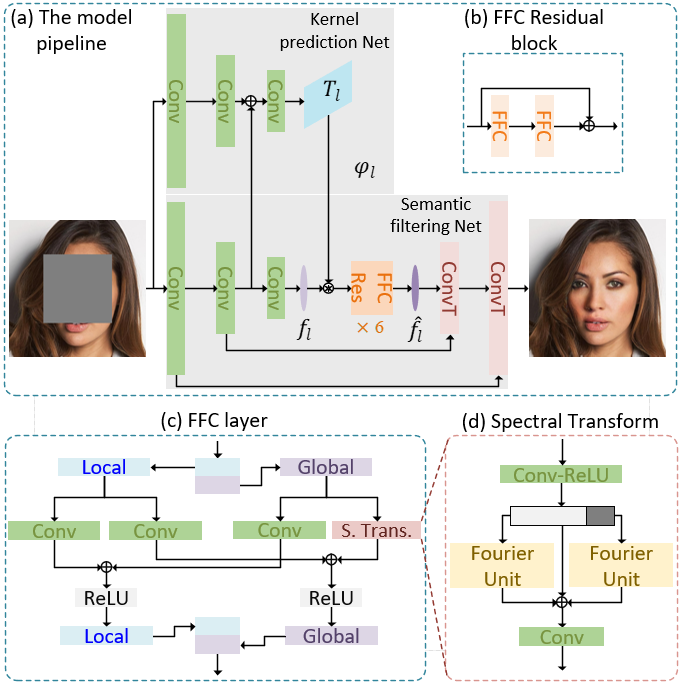
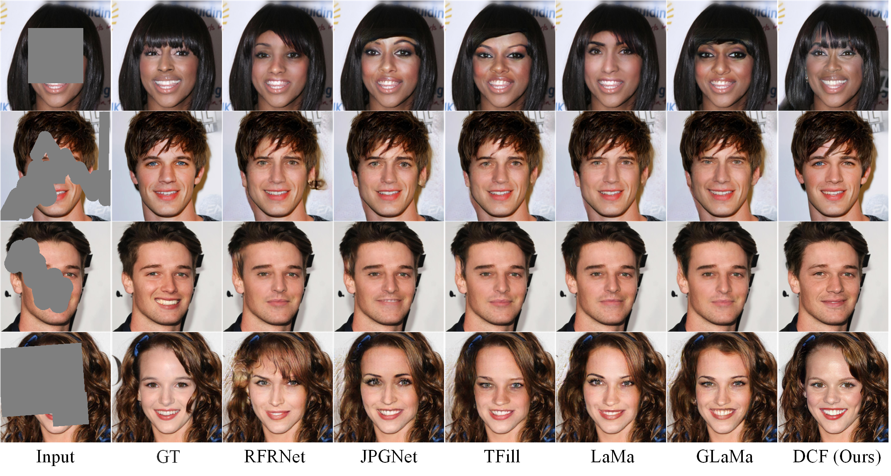

# DCF

## Image Completion via Dual-path Cooperative Filtering  
##### (The pretrained weights will be uploaded soon.)

### DCF Architecture

<a href="http://tensorlayer.readthedocs.io">

	

</a> </pre> </pre>  

### Results

<a href="http://tensorlayer.readthedocs.io">

	

</a>    

<a href="http://tensorlayer.readthedocs.io">

	

</a>    

### Installation

We test this repo with Python 3.8, PyTorch 1.9.0, and CUDA 11.1. However, it should be runnable with recent PyTorch versions (Pytorch >= 1.1.0).

### Data

- [CelebA](https://mmlab.ie.cuhk.edu.hk/projects/CelebA.html)

- [Places2](http://places2.csail.mit.edu/download.html)

- [Paris StreetView](https://github.com/pathak22/context-encoder/issues/24)

- [Mask](https://drive.google.com/file/d/1cuw8QGfiop9b4K7yo5wPgPqXBIHjS6MI/view?usp=share_link)

<!--- The dataset can be downloaded from this [kaggle link](https://www.kaggle.com/insaff/massachusetts-roads-dataset). Some of the images in training set does not have corresponding masks. The training code filters out those images. All the images are of size 800x800. Code for data analysis is in this notebook. -->
  
